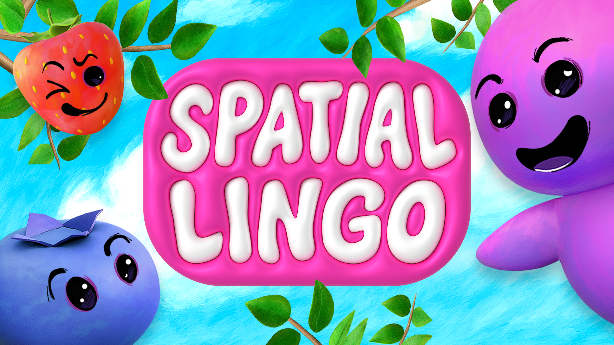
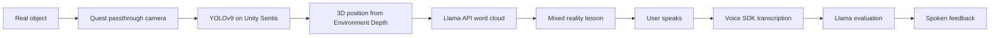
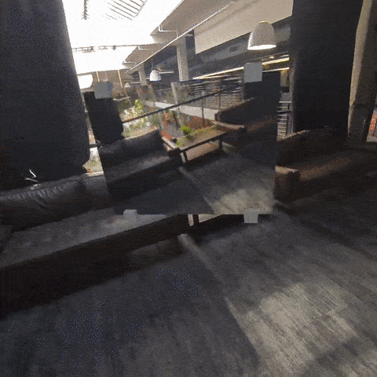
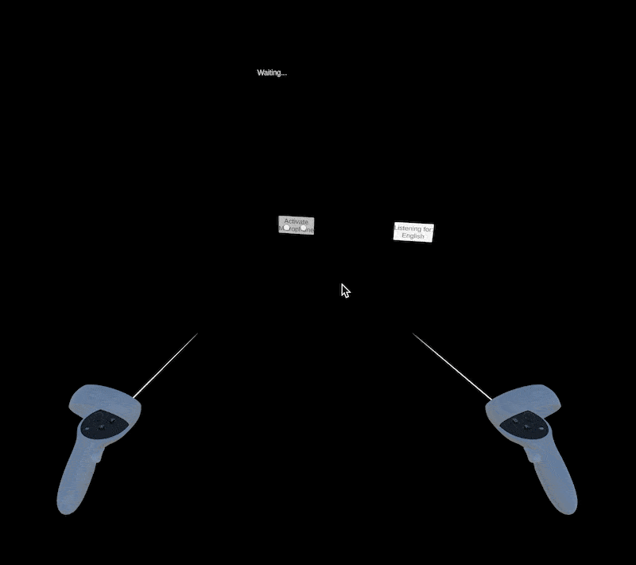
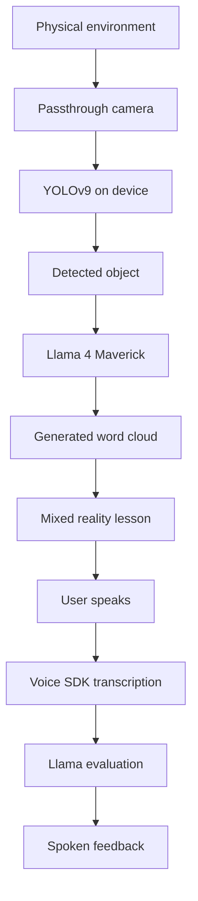
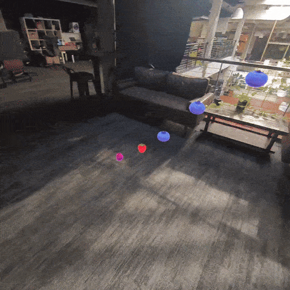
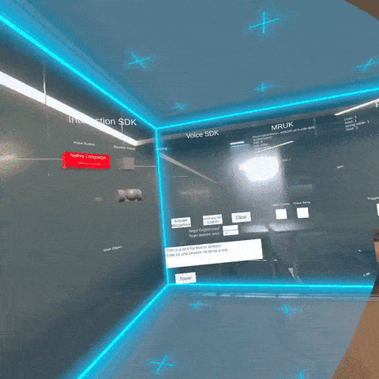

# Individual Assignment 1: Extended reality application teardown

| **Name**  | Fazle Mawla Wahyuhanda             |
| --------- | ---------------------------------- |
| **NRP**   | 5054241020                         |
| **Class** | Rekayasa Kecerdasan Artifisial (N) |
| **Batch** | 2024                               |

---

## Application information

| **Information** | **Details** |
| --- | --- |
| **Application** | Spatial Lingo: Language Practice |
| **Release date** | January 22, 2026 |
| **Developer** | Magnopus, for Meta |
| **Platform** | Meta Quest 3 |
| **XR category** | Mixed reality |
| **Main purpose** | Language practice |
| **AI and ML components** | YOLOv9 through Unity Sentis, Llama 4 Maverick through Llama API, and Voice SDK (wit.ai) |

The release date comes from [Meta's announcement](https://developers.meta.com/horizon/blog/spatial-lingo-open-source-app-ai-assisted-language-practice/). Magnopus lists the project as a Meta Quest 3 project released in January 2026. The official sources reviewed here identify Quest 3 as the target device, so Quest 3S is not listed as a confirmed platform.

## Contents

- [Introduction](#introduction)
- [Device class](#device-class)
- [Input modality](#input-modality)
- [Artificial intelligence](#artificial-intelligence)
- [Impact](#impact)
- [Limitations](#limitations)
- [Conclusion](#conclusion)
- [References](#references)

  

<em>Figure 1. Spatial Lingo title screen and virtual characters.</em>

---

## Introduction

Meta describes Spatial Lingo in its [developer announcement](https://developers.meta.com/horizon/blog/spatial-lingo-open-source-app-ai-assisted-language-practice/) as an open-source mixed reality application for practicing vocabulary with objects in the user's surroundings. Instead of starting with a fixed word list, the user looks around the room and works with objects that are already there. A chair, bottle, or laptop can become the subject of a lesson.

The application combines the Quest passthrough camera, on-device object detection, a large language model, and voice interaction. The camera provides images of the room. YOLO identifies objects, and the system places a word cloud near each detected object. Llama then supplies vocabulary and evaluates the user's spoken response. A small virtual companion named Golly Gosh speaks the lesson and gives feedback.

The main interaction loop is:

This design makes the room part of the lesson. The sources describe the software pipeline, but they do not report a controlled study of learning outcomes. Claims about better retention should therefore be treated as a design expectation, not as a measured result.

---

## Device class

Spatial Lingo runs on Meta Quest, a standalone head-mounted device. Because the application shows the real room through camera passthrough and places virtual content over that view, a precise classification is:

> **Standalone video see-through mixed reality head-mounted display (HMD)**

This experience does not rely on transparent optical see-through. Its outward-facing cameras capture the room, and the application displays that camera view together with virtual objects. The Passthrough Camera API supplies camera frames, while Environment Depth and MRUK help place detected objects in the user's space, as described in the [sample documentation](https://developers.meta.com/horizon/documentation/unity/unity-sample-spatial-lingo/).

This is why the application fits mixed reality better than pure virtual reality. The physical room remains visible and affects what the application shows, while digital word clouds, prompts, and the Golly Gosh character appear in the same space.

  

<em>Figure 2. Camera passthrough keeps the physical room visible.</em>

---

## Input modality

Spatial Lingo uses more than one input channel. Some channels come directly from the user, while others sense the surrounding space.

| **Input or signal** | **Function in the application** |
| --- | --- |
| **Hand tracking** | Lets the user perform squeeze and selection interactions without holding a controller |
| **Touch controllers** | Provides an alternative for selecting and interacting with mixed reality elements |
| **Voice and microphone** | Captures spoken answers for transcription and lesson evaluation |
| **Head movement and position** | Lets the user look around and approach word clouds placed in the room |
| **Passthrough camera and Environment Depth** | Detects objects and estimates their 3D positions; this is environmental sensing rather than a button-like input |

  

<em>Figure 3. Voice input scene used for transcription.</em>

The [official sample documentation](https://developers.meta.com/horizon/documentation/unity/unity-sample-spatial-lingo/) confirms hand tracking, controller input, voice transcription, passthrough camera access, and Environment Depth. Eye tracking is not listed as an input modality in the sources used for this teardown.

The combination makes Spatial Lingo a multimodal XR application. Hand or controller input handles selection, voice handles language practice, and camera plus depth data provide the context for each lesson.

---

## Artificial intelligence

AI is used in three connected parts of the experience. They do not all run in the same place or serve the same purpose.

### Object detection

YOLOv9 runs through Unity Sentis on the device and classifies camera images. The [technical documentation](https://developers.meta.com/horizon/documentation/unity/unity-sample-spatial-lingo/) says the sample uses 80 COCO object classes. Environment Depth then helps map a 2D detection into a 3D position so the word cloud can appear near the object.

The local detection step can reduce the need to send every full camera frame to a remote service. It also has a clear limitation: the model can only recognize the classes it supports, and performance can change with lighting, occlusion, or an unusual object.

### Language generation and evaluation

After YOLO identifies an object, the application crops the relevant image and sends the classification and image to Llama through the Llama API. Llama 4 Maverick can produce a bilingual word cloud with nouns, adjectives, and verbs. It also translates object names, evaluates the user's transcript, and generates dialogue for Golly Gosh.

For example, a detected chair can produce the target-language word for "chair" together with related words and a short speaking exercise. The model output is useful for varying the lesson, but it can still contain an incorrect translation or an unsuitable example. The application should treat the output as generated content rather than as a guaranteed dictionary entry.

### Speech interaction

The Voice SDK, which the technical documentation identifies as wit.ai, provides speech-to-text and text-to-speech. It transcribes the user's answer, sends the transcript to Llama for evaluation, and converts Golly Gosh's response back into speech.

Voice SDK handles the audio service, while Llama handles language generation and evaluation. The full experience depends on computer vision, a remote language model, and speech services working together.

  

<em>Figure 4. Word-cloud interaction placed in the user's room.</em>

---

## Impact

### Learning and interaction

Spatial Lingo's main design choice is contextual vocabulary practice. The object that supplies the word is physically present in front of the user, so the lesson has a direct visual referent. This could make the exercise easier to connect to everyday situations than a detached list of words. The official materials describe the implementation, but they do not provide a controlled comparison with flashcards or a conventional language-learning app. The possible learning benefit should therefore be described as a hypothesis, not as a proven outcome.

The voice step adds practice that a text-only vocabulary app cannot provide. Users must say the target word or sentence, and the system checks the transcript. Recognition errors can still produce unfair feedback when there is background noise, an accent, or a pronunciation that the service handles poorly.

### Privacy and data flow

The application needs access to the Quest camera, microphone, and spatial data. Meta's [Passthrough Camera API guidance](https://developers.meta.com/horizon/documentation/spatial-sdk/spatial-sdk-pca-overview/) classifies camera images as Device User Data and requires developers to follow camera-access policies. The [Spatial Lingo announcement](https://developers.meta.com/horizon/blog/spatial-lingo-open-source-app-ai-assisted-language-practice/) also says that the detected image crop is sent to the Llama API. This creates a data-transfer and network dependency even though the first YOLO classification runs on the device.

The camera may capture private rooms, documents, or other people who are not using the application. The sources used here do not specify how long those images or transcripts are retained. The report should not claim that data is permanently deleted or stored unless a current privacy policy confirms it.

### Accessibility and wider use

Hand tracking and controllers give users two ways to select objects, but speaking remains central to the lesson. That can exclude users who cannot speak clearly or who find voice input unreliable. The available sources do not include an accessibility evaluation.

The same pipeline could be adapted for technical training, maintenance instructions, or museum interpretation. Those are possible extensions, not features demonstrated by the current application. An extension would also inherit the model-coverage, privacy, and network issues described above.

  

<em>Figure 5. Gym scene used to inspect spatial and voice systems.</em>

---

## Limitations

- YOLO is limited to its supported COCO classes and can misclassify or miss objects.
- Camera lighting, occlusion, and object size can affect detection and placement.
- Speech recognition can be affected by accents, pronunciation, and background noise.
- Llama-generated vocabulary, dialogue, or evaluation can be inaccurate.
- Llama API and Voice SDK calls introduce network availability and external-service dependencies.
- Camera, microphone, and spatial-data permissions create privacy responsibilities for the user and developer.
- The official [announcement](https://developers.meta.com/horizon/blog/spatial-lingo-open-source-app-ai-assisted-language-practice/) described the store release as U.S.-only at launch, which limits availability for users in other regions.
- The available sources do not report learning results from a user study, so educational effectiveness remains unverified.

These limitations matter because the experience is a chain. A failed camera permission, missed detection, network error, bad transcript, or incorrect Llama response can interrupt the lesson.

---

## Conclusion

Spatial Lingo is a standalone mixed reality application for Meta Quest 3. Its main inputs are hand tracking, controllers, voice, head movement, and environmental camera and depth data.

The application uses YOLOv9 through Unity Sentis for on-device object detection, Llama 4 Maverick through the Llama API for vocabulary generation and answer evaluation, and Voice SDK for speech-to-text and text-to-speech. The distinctive part of the design is the link between a real object, a generated lesson, and a spoken response.

That link gives the application a clear educational idea, but it does not remove the usual problems of AI systems. Recognition and translation can be wrong, cloud services add latency and data-transfer concerns, and voice input is not equally accessible to every user. Spatial Lingo is best understood as an open-source demonstration of an MR and AI pipeline, not as proof that the pipeline improves language learning.

## References

1. Meta Horizon OS Developers. [Spatial Lingo: An Open Source App for AI-Assisted Language Practice with Everyday Objects](https://developers.meta.com/horizon/blog/spatial-lingo-open-source-app-ai-assisted-language-practice/). January 22, 2026.

2. Meta Horizon OS Developers. [Spatial Lingo technical documentation](https://developers.meta.com/horizon/documentation/unity/unity-sample-spatial-lingo/). Updated May 11, 2026.

3. Oculus Samples. [Unity-SpatialLingo repository](https://github.com/oculus-samples/Unity-SpatialLingo). GitHub.

4. Magnopus. [Spatial Lingo project page](https://www.magnopus.com/projects/spatial-lingo). Release date listed as January 2026.

5. Meta Horizon OS Developers. [Passthrough Camera API overview](https://developers.meta.com/horizon/documentation/spatial-sdk/spatial-sdk-pca-overview/). Camera images are treated as Device User Data.
6. Meta Horizon OS Developers. [Spatial data permission](https://developers.meta.com/horizon/documentation/unity/unity-spatial-data-perm/). Permission requirements for spatial and depth data.
